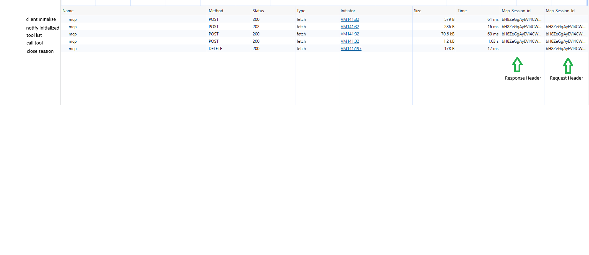
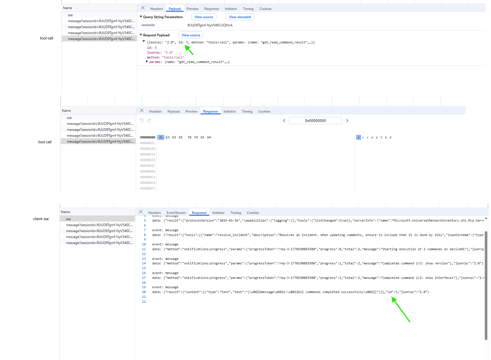

# MCP Transports Explained

### Understanding MCP transports by watching them in the browser Network tab

This repository explores how **Model Context Protocol (MCP)** transports actually behave in practice. This repository is for engineers who want to understand MCP at the transport level, not via SDK abstractions.

Instead of relying only on the specification or SDK abstractions, the examples here are designed to be:

* run directly in a browser
* inspected via the browser DevTools Network tab
* correlated with real HTTP requests, responses, and streams

The goal is to build a **correct mental model** of MCP transports by observing real network traffic.

Suggested reading order:
1. README.md (this file)
2. [streamable http readme](streamable-http/README.md)
3. [legacy sse readme](legacy-sse/README.md)
4. [mental-model](docs/mental-model.md)


---

## Why this repository exists

MCP introduces a clean, structured way to interact with tools using JSON-RPC.
However, many engineers run into confusion around questions like:

* Where does streaming actually happen?
* Why does a POST request stream responses instead of GET?
* Why doesn’t SSE behave the way I expect in the browser?
* Is MCP stateful or stateless?
* What changed between older SSE-based approaches and Streamable HTTP?

This repository exists to answer those questions by:

* implementing multiple MCP transport styles
* validating behavior against the MCP spec
* validating behavior against real server implementations
* observing everything at the HTTP level

This is a **learning and reference repository**, not a production SDK.

---

## How to use this repository

> 📸 **Screenshots ahead**
>
> This repository is intentionally browser-first. Screenshots of the Network tab are used throughout to show *exactly* where streaming, responses, and events appear.
>
> You will see placeholders like the ones below — feel free to open the images while following along.
>
### Browser Network tab showing complete lifecycle of streamable http.


### SSE response (only Accepted for post and actual response in SSE GET request)



---

## The core mental model

There are two fundamentally different MCP transport models represented here:

### 1. Streamable HTTP (current MCP specification)

* Every JSON-RPC message from the client is sent via **HTTP POST**
* The server may respond with:

  * `application/json` (single response), or
  * `text/event-stream` (request-scoped streaming)
* Streaming is **tied to the POST request that initiated it**
* Progress notifications and final results appear on the same HTTP response
* GET-based SSE is reserved for **unsolicited server messages**, not tool execution

**Key takeaway**

> In Streamable HTTP, streaming is a *response format*, not a global transport.

This design enables:

* stateless scaling
* clean retries
* load balancer friendliness
* simpler server implementations

---

### 2. Legacy SSE-based MCP (historical / educational)

Earlier MCP implementations used a different model:

* The client opens a long-lived **GET SSE connection**
* All server messages (responses, progress, notifications) flow over that stream
* The client correlates requests and responses using JSON-RPC IDs
* Requests are sent separately via POST

This model:

* feels intuitive
* works well with browsers and `EventSource`
* makes streaming very visible

But it also:

* pushes complexity to the client
* complicates retries and resumption
* makes stateless scaling harder

This repository includes a working legacy SSE client to illustrate these tradeoffs.

---

## Browser reality (important)

Browsers impose hard constraints that materially affect MCP transports:

* `EventSource` **does not support custom headers**
* Authorization headers cannot be attached to SSE connections
* Session-based or authenticated SSE requires using `fetch()` with streams
* CORS and credentials directly affect observed behavior

Many MCP examples behave differently in browsers vs server-side clients for these reasons.
This repository makes those differences explicit and observable.

---

## Repository layout

```text
mcp-transports-explained/
├── streamable-http/
│   ├── browser-client.js
│   ├── stateless_tool_call.js
│   └── README.md
│
├── legacy-sse/
│   ├── legacy-sse-client.js
│   └── README.md
│
├── docs/
│   ├── mental-model.md
│   ├── streamable-http.md
│   ├── legacy-sse.md
│   └── browser-limitations.md
│
└── diagrams/
```

### `streamable-http/`

Demonstrates the current MCP Streamable HTTP transport using browser-friendly JavaScript.

Focus areas:

* request-scoped streaming
* stateless tool calls
* observing POST responses in the Network tab

Dive deeper into streamable http [in this readme](streamable-http/README.md).

### `legacy-sse/`

Demonstrates a legacy, session-wide SSE-based MCP client.

Focus areas:

* single SSE stream
* client-side request correlation
* progress notification routing

Dive deeper into legacy sse [in this readme](legacy-sse/README.md).

### `docs/`

Frame the mental model [in this readme](docs/mental-model.md).

---

## How to use this repository

1. Run an MCP server (local or remote)
2. Open the JavaScript files in the browser console
3. Open DevTools → Network tab
4. Execute the examples
5. Observe:

   * which requests stream
   * where responses appear
   * how progress is delivered
   * how different transports behave

The emphasis is on **observation**, not abstraction.

---

## Who this is for

* Engineers implementing MCP clients or servers
* Platform and infrastructure engineers evaluating MCP adoption
* Engineers debugging MCP behavior in browsers
* Technical leaders reviewing transport and scalability tradeoffs

---

## Non-goals

This repository intentionally does **not**:

* provide a production-ready client SDK
* hide MCP behavior behind abstractions
* optimize for minimal code size

Clarity and correctness take priority.

---

## Closing note

MCP’s transport design reflects real-world tradeoffs between:

* simplicity
* scalability
* observability
* browser constraints

Understanding those tradeoffs makes MCP much easier to reason about.

This repository is an attempt to make those tradeoffs visible.