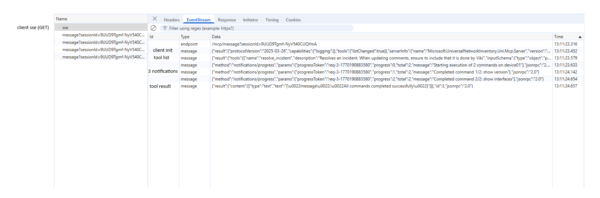

# Legacy SSE Transport (MCP)

This directory documents the **legacy Server-Sent Events (SSE) transport model** that earlier MCP implementations used before Streamable HTTP became the recommended approach.

The purpose of this folder is **educational**: to show how MCP originally worked, why it felt intuitive, and why it was eventually replaced.

---

## TL;DR

In the legacy SSE model:

* The client opens a long-lived **GET + text/event-stream** connection
* All server messages flow through this single stream
* Tool results, progress, and notifications share the same channel
* The client is responsible for correlating requests and responses
* The connection is stateful and session-oriented

This model is simple to visualize, but harder to scale reliably.

---

## What this folder demonstrates

Using the script in this directory, you can observe that:

* A single GET request remains open for the lifetime of the session
* All server → client communication flows through that connection
* Multiple tool calls share the same stream
* Client-side routing logic is required

This makes the protocol feel conversational and continuous, especially in browsers.

---

## Files in this directory

### `legacy-sse-client.js`

A browser-based MCP client that uses a session-wide SSE connection.

It:

* Opens a persistent GET request with `Accept: text/event-stream`
* Listens for all server messages on that stream
* Sends requests via POST to a server-provided endpoint
* Correlates responses using JSON-RPC IDs

This script illustrates how MCP behaved prior to Streamable HTTP.

**What to observe in DevTools**

> 📸 **Placeholder**: Single long-lived GET request with continuous SSE events

### 1. The "Long Pipe" Lifecycle

Unlike Streamable HTTP, the lifecycle here is dominated by a **single, persistent GET request**.

*   **The initial handshake:** The client hits `GET /sse`.
*   **The Endpoint Event:** The server sends an `endpoint` event via SSE, telling the client where to send POST requests.
*   **The POSTs:** All subsequent tool calls are sent to that specific endpoint.

---

### 2. The Disconnected Response

When you trigger a tool via `POST`, the response does **not** contain the result.

*   The server returns `202 Accepted` (or `200 OK` with no body).
*   This confirms "I received your request," not "Here is your answer."
*   The actual data arrives separately over the GET stream.

---

### 3. The Event Stream (Interleaved Events)

To find your result, you must scan the global GET stream. This is where multiple parallel requests get mixed together.

*   **Request Payload:** You sent `id: 5` in the POST.
*   **Event Stream:** You must scan every incoming message for `id: 5`.
*   If multiple tools run at once, their chunks arrive interleaved on this single pipe.

---

## Step-by-step: observing legacy SSE

1. Open your browser DevTools
2. Navigate to the **Network** tab
3. Run `legacy-sse-client.js`
4. Locate the persistent GET request
5. Inspect its **EventStream** tab

You should notice:

* The connection remains open across multiple tool calls
* Messages for different requests are interleaved
* No per-request streaming connections exist

---

## How request correlation works

Because all messages arrive on the same stream, the client must:

* establish a session using `Mcp-Session-Id`
* assign a unique JSON-RPC `id` to every request
* track pending requests locally
* route incoming responses to the correct caller
* associate progress notifications manually

This requires non-trivial client-side state management.

In contrast, Streamable HTTP pushes most of this complexity to the server.

---

## Why this model felt natural

The legacy SSE approach aligns closely with how people intuitively think about streaming systems:

* one connection
* continuous updates
* conversational flow

In browsers, this model works especially well with `EventSource`, which abstracts much of the SSE handling.

As a result, early MCP clients were relatively easy to implement.

---

## Limitations of legacy SSE

Over time, several challenges became apparent:

### Scalability

* Long-lived connections consume server resources
* Load balancing requires sticky sessions
* Horizontal scaling becomes harder

### Reliability

* Network interruptions break the primary communication channel
* Resumption requires custom logic
* Partial failures are harder to isolate

### Client complexity

* Request routing logic lives in every client
* Error handling is more involved
* Concurrency management is harder

These issues grow with system size.

---

## Relationship to Streamable HTTP

Streamable HTTP addresses these limitations by:

* moving streaming to per-request responses
* enabling stateless execution
* simplifying retry and cancellation
* reducing client-side bookkeeping

The legacy SSE model represents an important evolutionary step, but is no longer the preferred approach for most MCP deployments.

---

## When legacy SSE may still be useful

Despite its limitations, legacy SSE can still make sense when:

* simplicity is more important than scalability
* deployment size is small
* browser-only environments are required
* strong session affinity already exists

In such cases, the model can remain practical.

---

## Next

To understand the modern transport model, see:

* `streamable-http/README.md`

Comparing both approaches side by side provides a complete picture of MCP transport design.
