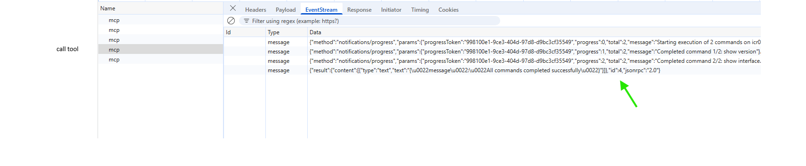
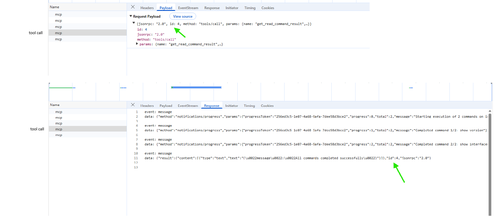
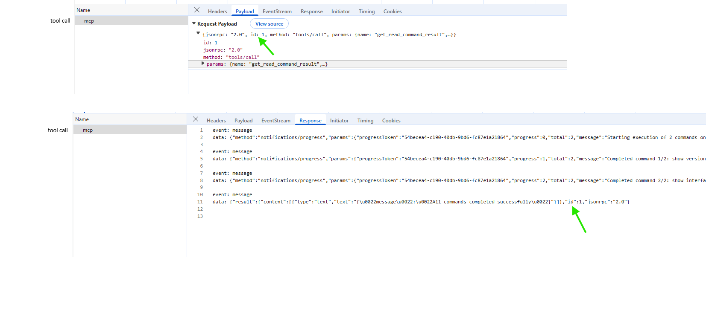

# Streamable HTTP (MCP)

This directory focuses exclusively on the **Streamable HTTP transport**, which is the **current and recommended** MCP transport.

The goal here is not to abstract MCP behind a client library, but to **observe exactly what happens on the wire** by running the examples in a browser and inspecting the Network tab.

---

## TL;DR

In Streamable HTTP:

* Tool calls are sent as **HTTP POST** requests
* Streaming, when present, happens on the **POST response**
* There is **no global execution stream** for tools
* MCP can operate in a **fully stateless** mode

---

## What this folder demonstrates

Using the scripts in this folder, you can directly observe that:

* Every MCP request is an **HTTP POST**
* Streaming, when it happens, occurs on the **POST response**
* There is **no global stream** for tool execution
* Progress notifications and final results share the same response
* MCP can operate in a fully **stateless** manner

This often contradicts first intuition — which is exactly why this folder exists.

---

## Authentication and session handling

The scripts in this folder are intentionally written to work with **both major Streamable HTTP deployment models**:

### 1. Header-based sessions (`Mcp-Session-Id`)

Some MCP servers issue an explicit session identifier:

```
Mcp-Session-Id: <opaque-id>
```

In this mode:

* The client echoes `Mcp-Session-Id` on subsequent requests
* The server may maintain per-session context
* Sticky sessions may be used

### 2. Cookie-based sessions

Other deployments rely on standard HTTP cookies for session and identity management.

In this mode:

* No `Mcp-Session-Id` header is exposed
* Session state is bound to cookies
* Requests must use `credentials: "include"`

### 3. Fully stateless mode

Streamable HTTP does **not require** a session identifier at all.

In stateless mode:

* No `Mcp-Session-Id` is used
* No cookies are required
* Each request is independent
* Servers can scale without affinity

This is compliant with the MCP specification and is the preferred model for large-scale deployments.

The provided scripts automatically adapt to all three models.

---

## Files in this directory

### `browser-client.js`

A browser-friendly MCP client that:

* Uses `fetch()` with `Accept: application/json, text/event-stream`
* Handles both JSON and SSE-style responses
* Parses streaming responses incrementally

This script is useful for understanding:

* how MCP streaming appears in the Network tab
* why reading from the stream affects what DevTools shows
* how browsers handle `text/event-stream` responses on POST

---

## What to observe in DevTools

### 1. Complete lifecycle of streamable HTTP (stateful)

In the standard lifecycle, you will see a waterfall of 5 distinct requests. Even though they look like identical `POST`s to the same endpoint, they represent a full conversation:

1.  **Handshake (`initialize`)**: The first POST. Client sends capabilities; Server assigns a Session ID.
2.  **Notification (`notifications/initialized`)**: Client confirms it is ready.
3.  **Discovery (`tools/list`)**: Client asks "What tools do you have?".
4.  **Execution (`tools/call`)**: The actual work. **This is where streaming happens** (see next section).
5.  **Teardown (`DELETE`)**: Client explicitly closes the session.


---

### 2. Tool Call: Streaming Progress (The "EventStream" Tab)

When you click on the `tools/call` request, look at the **EventStream** or **Response** tab.

*   You will see `notifications/progress` events arriving *while the request is still pending*.
*   The server uses `Content-Type: text/event-stream` on the **response** to achieve this.



---

### 3. Tool Call: Final Response

The final result arrives on the same stream as the progress.

*   Notice the `id` field matches the request, but this is just for protocol compliance.
*   The connection closes immediately after this message.



---

## `stateless_tool_call.js`

A minimal example that demonstrates **true stateless MCP execution**.

Characteristics:

* No reliance on long-lived connections
* Each tool call is a standalone HTTP POST
* Streaming is scoped to the lifetime of the request

This file is intentionally small and direct. Its purpose is to answer a single question:

> *How does MCP scale behind a load balancer?*

The answer becomes obvious when you observe that no shared connection or session affinity is required.

### What to observe in DevTools

> Single POST request with streamed response completing and closing cleanly

### Tool Call: The "One-Shot" Execution

Compare this to the 5-phase lifecycle above.

*   There is no `initialize` phase.
*   There is no `Mcp-Session-Id`.
*   The request executes, streams, and closes.

This proves that MCP can run on purely stateless infrastructure (like Lambda or Kubernetes) without sticky sessions.



---

## Step-by-step: observing Streamable HTTP

1. Open your browser DevTools
2. Navigate to the **Network** tab
3. Run one of the scripts in this folder
4. Click on the corresponding POST request
5. Inspect:

   * **Headers** → `Accept`, `Content-Type`
   * **Response / EventStream** tab
   * Timing and request lifetime

You should notice:

* Streaming occurs **only** on the response
* No additional GET requests are involved
* The connection closes once the response is complete

---

## Common misconceptions clarified

### “Is Streamable HTTP using SSE like traditional EventSource?”

No.

In Streamable HTTP, **SSE is used only as a response encoding**, not as a bidirectional or session-wide transport.

Concretely:

* The client sends a normal HTTP **POST** request
* The server may choose to encode the **response body** as `text/event-stream`
* That SSE stream lives **only for the lifetime of that response**
* Once the response completes, the stream is closed

There is no long-lived, server-pushed event channel for tool execution.

This is very different from traditional SSE usage with `EventSource`, where a single GET request stays open and delivers all events.

---

### “If Streamable HTTP supports stateless calls, why do `initialize` and `notifications/initialized` exist?”

This is a common and reasonable question.

Streamable HTTP supports **stateless execution**, but MCP as a protocol supports **more than just tool calls**.

The initialization phase exists to enable capabilities that cannot be negotiated on a per-call basis, such as:

* client and server capability exchange
* tool discovery and schema negotiation
* client elicitation and follow-up requests
* progress, cancellation, and richer interaction patterns

In practice:

* **Stateless mode** is ideal for simple, scalable tool execution
* **Session-based mode** enables richer, conversational or interactive flows

Both models are supported intentionally.

Initialization also enables deployments that rely on:

* sticky sessions
* authenticated user context
* server-side execution context

Streamable HTTP does not remove these capabilities — it simply makes them optional, rather than mandatory.

---

### “What is the GET SSE endpoint used for in Streamable HTTP?”

The GET + `text/event-stream` endpoint exists for **unsolicited, session-level server messages**, not for tool execution.

According to the MCP specification, this stream may carry:

* server-initiated JSON-RPC requests
* server-initiated notifications
* background or asynchronous events
* resumed events after disconnection (via `Last-Event-ID`)

These messages are expected to be **unrelated to any single POST request**.

In simple tool-only setups, servers often never emit such messages. In that case, the GET stream may open and immediately close, or remain idle.

This is expected behavior.

The GET stream functions as a **session mailbox**, allowing the server to reach the client without waiting for a new POST.

---

### “Why isn’t the GET SSE endpoint used for tool calls?”

In Streamable HTTP, SSE is a **response format**, not a transport.

Tool execution is tied to the request that initiated it. This enables:

* cancellation
* retries
* clear request ownership

A global GET stream would complicate these properties.

---

### “Why does the Network tab sometimes look empty while streaming?”

Browsers buffer and display streaming responses differently depending on:

* whether the response body is actively read
* timing of DevTools attachment
* how the stream is consumed

This is expected behavior and part of what this folder helps you observe.

---

## Why this design matters

Streamable HTTP may look less intuitive than a single long-lived SSE connection, but it enables:

* horizontal scalability
* stateless servers
* simpler infrastructure
* predictable failure modes

These properties are critical for production MCP servers.

---

## Next

If you want to compare this with a session-wide SSE model, see:

* `legacy-sse/README.md`

That comparison makes MCP’s transport evolution much easier to appreciate.